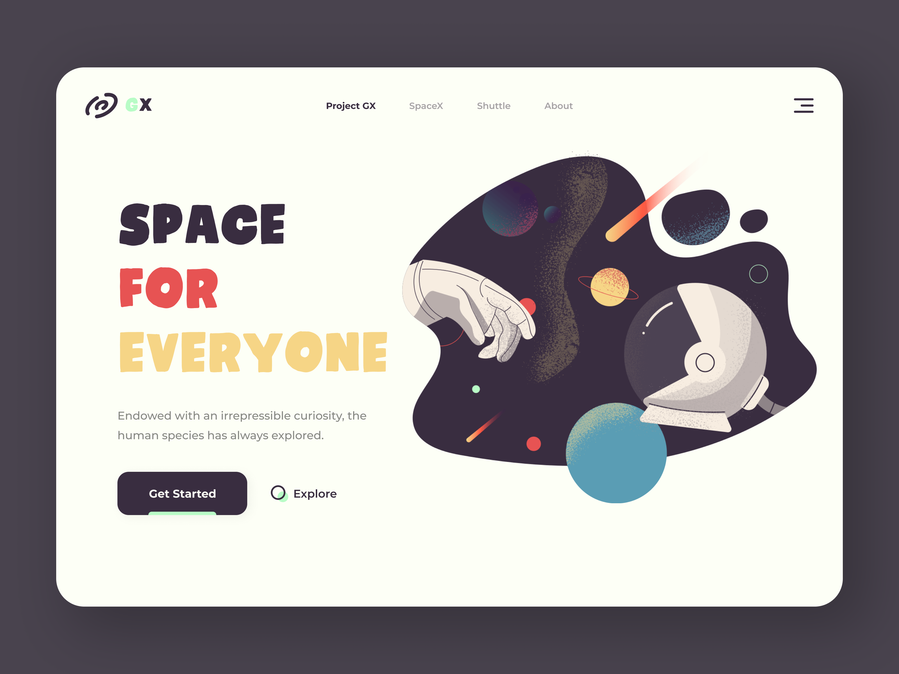

# About

This project was bootstrapped with [Create React App](https://create-react-app.dev/) and TypeScript has been added to it.

This project is to provide a brief overview of SpaceX's _rockets_ and _dragons_.

[SpaceX's open API](https://docs.spacexdata.com/) is being used for fetching the data.

If you clone this repository, don't forget to run `yarn` command to install all necessary libraries for running this app.

## How to run this app

In the project directory, you can run:

### `yarn start`

This will display the app in the browser under [http://localhost:3000](http://localhost:3000).

### `yarn test`

This will run all the test suites in the app.

# UX/UI

The inspiration for UX and theme colours for this app came from this image:
<a href="https://dribbble.com/shots/12090041-Planet-Explorer" target="_blank" rel="noreferrer noopener">

<a/>